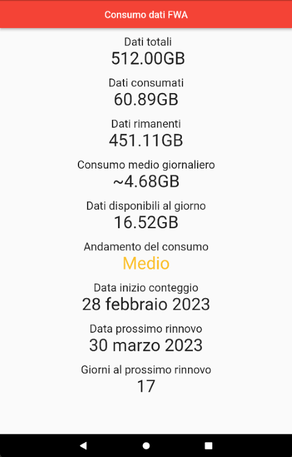

# FWA data consumption

App android per controllare la quantità di GB residui fino al successivo rinnovo della linea FWA di Vodafone.

## Utilizzo

Collegarsi alla rete WiFi della vostra Vodafone Station FWA e aprire l'app. Quest'ultima vi mostrerà:
+ La quantità di GB totali
+ La quantità di GB consumati
+ La quantità di GB rimanenti
+ La quantità di GB utilizzati in media per giorno 
+ La quantità di GB utilizzabili al giorno
+ Alcuni consigli sul consumo per arrivare al prossimo rinnovo
+ La data di inzio del conteggio
+ La data del prossimo rinnovo
+ Giorni mancanti al prossimo rinnovo

Per refreshare la pagina, fare swipe down.

## Screenshot app
Pagina inziale dell'app dove vengono mostrati tutti i dati

Pagina iniziale quando la connessione è assente oppure non si è connessi alla rete WiFi della Vodafone Station FWA

